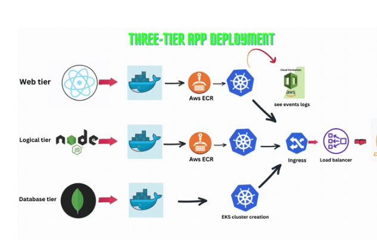
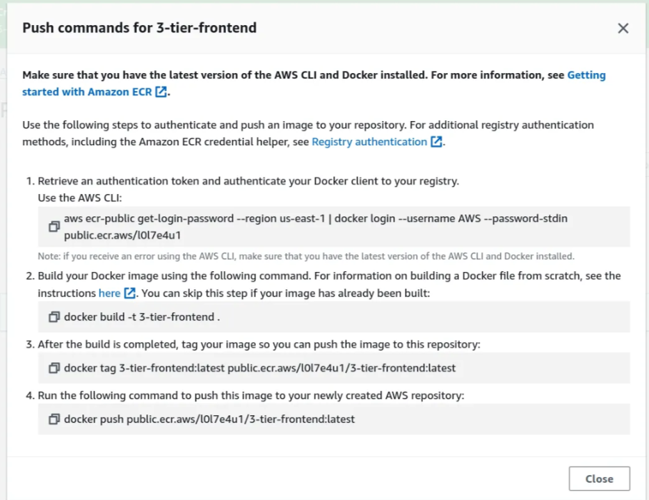

# 3-tier-application-deployment-on-Kubernetes



Deploying a three-tier application on Kubernetes involves dividing your system into three distinct parts:

1. **Presentation Layer (Tier 1)**: This is what users see when they visit your website. It’s the interface that users interact with directly.

2. **Logical Layer (Tier 2)**: Think of this layer as the brain behind the scenes. It processes the information provided through the user interface according to the system's rules. For example, on a shopping website, this layer calculates the total price of items, applies discounts, and checks stock availability.

3. **Data Layer (Tier 3)**: This layer is responsible for storing and retrieving data. It acts as the system's memory, managing and storing information needed by the system. Data can be stored in databases, files, or other storage systems.

## Steps to Complete This Task

**Stage 1**: Set Up EC2 and IAM User  
- Create an IAM User.
- Attach policies directly to the IAM User, providing administrator access.
- Click on the IAM User, go to Security Credentials.
- Scroll down, click on Access Keys, and create new access keys.
- Choose AWS CLI from the options listed.
- Download the CSV file containing your username and password or copy them to your notepad.

### Next Steps:

A. Launch your EC2 instance where all the tasks will be performed:
   - Connect to your EC2 instance and run the following commands:
     ```bash
     sudo su
     apt update
     mkdir 3-tier # You can change the directory name as desired
     cd 3-tier
     ```
B. Fetch the code from GitHub by cloning the repository:
   ```bash
   git clone https://github.com/Aakibgithuber/Three-tier-Application-Deployment-.git
   ```

- Run `ls` to view the contents of the repository.

C. The next step is to set up AWS CLI, Docker, Kubectl, and Eksctl.

**AWS CLI (Amazon Web Services Command Line Interface)** allows us to interact with AWS services using commands.

- Run this command to install AWS CLI:
  ```bash
  snap install aws-cli --classic
  ```

- Configure AWS CLI:
  ```bash
  aws configure
  ```
  It will ask for the access key and secret key. Open the CSV file you downloaded earlier and copy the access key and secret key. Your AWS CLI should now be set up.

**Next, set up Docker:**

- Follow the installation instructions on the [Docker official website](https://docs.docker.com/engine/install/ubuntu/#install-from-a-package).

- After successfully installing Docker with the latest build, run these commands:
  ```bash
  usermod -aG docker $USER  # Replace $USER with your username, e.g., 'ubuntu'
  newgrp docker
  sudo chmod 777 /var/run/docker.sock
  which docker
  ```

**Next, set up Kubectl to install Kubernetes cluster:**

- Run this command:
  ```bash
  snap install kubectl --classic
  ```

**Next, set up Eksctl:**

Eksctl is a command-line tool used for managing Amazon EKS (Elastic Kubernetes Service) clusters.

- Run these commands to install Eksctl:
  ```bash
  curl --silent --location "https://github.com/weaveworks/eksctl/releases/latest/download/eksctl_$(uname -s)_amd64.tar.gz" | tar xz -C /tmp
  sudo mv /tmp/eksctl /usr/local/bin
  eksctl version
  ```
  
**Stage 2**: Build Frontend and Backend Images

**A. Set up Elastic Container Registry (ECR)**  
ECR is similar to Docker Hub, where we store Docker images.

- Go to your AWS console, search for ECR, and click on "Create repository" for the frontend. Set the visibility setting to public.
- In your terminal, navigate to the frontend directory and run the `ls` command.
- Go to your ECR repository and click on "View push commands."



**B. Build and Push the Frontend Image**

Run the following commands one by one to build the frontend image and push it to the ECR repository:

```bash
aws ecr-public get-login-password --region us-east-1 | docker login --username AWS --password-stdin public.ecr.aws/l0l7e4u1
docker build -t 3-tier-frontend .
docker tag 3-tier-frontend:latest public.ecr.aws/l0l7e4u1/3-tier-frontend:latest
docker push public.ecr.aws/l0l7e4u1/3-tier-frontend:latest
```

**C. Run a Container from the Frontend Image**

1. List your Docker images to copy the image name:
   ```bash
   docker images
   ```

2. Run the frontend container:
   ```bash
   docker run -d -p 3000:3000 3-tier-frontend:latest
   ```

*Note: Ensure port 3000 is allowed in your inbound rules in the NSG (Network Security Group).*

- You can now check if your frontend is set up and running by browsing to `public-ip:3000`. The application should be running on port 3000.

**Set Up Backend**

**A. Set Up the Backend**

1. Navigate to the backend directory.
2. Go to your ECR repository and click on "View push commands" for the backend repository.


3. Run the following commands one by one in your terminal:

```bash
aws ecr-public get-login-password --region us-east-1 | docker login --username AWS --password-stdin public.ecr.aws/l0l7e4u1
docker build -t 3-tier-backend .
docker tag 3-tier-backend:latest public.ecr.aws/l0l7e4u1/3-tier-backend:latest
docker push public.ecr.aws/l0l7e4u1/3-tier-backend:latest
```

Now your backend image is successfully built and pushed to the Elastic Container Registry, which will be used when creating the Elastic Kubernetes Service.

**Stage 3**: Configure Kubernetes  
**Stage 4**: Set Up Application Load Balancer and Ingress  
**Stage 5**: Tear Down the Infrastructure